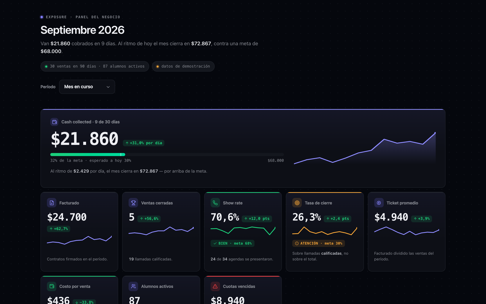

# EXPOSURE · Panel del negocio

Un dashboard de negocio en **un solo archivo**. Sin base de datos, sin servidor, sin instalar nada.
Se abre con doble clic y funciona hasta con el wifi apagado.



---

## Cómo se usa (30 segundos)

1. **Descargá el proyecto** — botón verde `Code` → `Download ZIP` → descomprimir.
2. **Doble clic en `index.html`.** Listo, ya lo estás viendo.
3. **Para poner tus números:** abrí `datos.js` con cualquier editor de texto, cambiá lo que quieras,
   guardá y recargá la página.

Eso es todo. No hay `npm install`, no hay build, no hay cuenta que crear.

---

## El único archivo que se toca: `datos.js`

Está comentado línea por línea. La regla es una sola:

> **Ahí adentro solo van números crudos: lo que pasó.**
> Los porcentajes, promedios, tasas, deltas, leaderboards y la proyección **no se escriben**:
> los calcula el dashboard solo. Si tocás un número, todo el resto se recalcula.

Lo que se carga:

| Bloque | Qué es |
|---|---|
| `marca` | Nombre, moneda y la **meta mensual** de cash collected (la vara de todos los semáforos) |
| `meses` | Una fila por mes. La última es el mes en curso: lleva `dias` y `diasTotal` y se muestra como parcial |
| `closers` / `setters` | El equipo de los últimos 90 días |
| `fuentes` | De dónde salen los leads |
| `contenido` | Piezas, views, leads y agendas por formato |
| `cuotas` | Las cobranzas del mes, con su estado |
| `llamadas` | Las últimas llamadas cargadas |

Al final del archivo hay un `MODO_DEMO`. Mientras esté en `true` se muestra un sello discreto que
avisa que los números son de demostración. Cuando cargues los tuyos, ponelo en `false`.

---

## Lo que hace solo

- **Selector de período** — mes en curso, mes pasado, 90 días, 12 meses. Todo se recalcula y se
  vuelve a animar.
- **El mes en curso se trata como parcial.** Con 9 de 30 días cargados, el dashboard compara contra
  el **ritmo diario** del mes anterior (si no, un mes de 9 días pierde siempre contra uno de 31),
  proyecta el cierre del mes y marca en la barra dónde deberías estar hoy.
- **Semáforos con umbral escrito.** Nunca solo color: cada estado dice la palabra y contra qué vara
  se mide, así se entiende en un proyector y también si sos daltónico.
- **Titulares calculados.** Cada sección abre con una frase que sale de los datos —
  *"el paso que más lejos está de su vara es la tasa de cierre"* — no con una etiqueta genérica.
- **Gráfico anual con vista Mensual / Acumulado**, tooltips con el detalle del mes, embudo con las
  conversiones paso a paso, leaderboards, donut de fuentes, cobranzas y proyección a 3 meses al
  ritmo compuesto de los últimos 3.

## Cómo cambiar las varas

Los umbrales de los semáforos están en `index.html`, en la función `pintarKpis`. Buscá `semaforo(`:

```js
const sr = semaforo(a.showRate, 68, 60);          // verde ≥68%, ámbar ≥60%, rojo abajo
const tc = semaforo(a.tasaCierre, 30, 24);        // tasa de cierre
const cac = semaforo(a.cac, 600, 900, true);      // invertido: menos es mejor
```

Y las varas del embudo están en `pintarEmbudo`, en el array `pasos` (`vara: 12`, `vara: 68`…).

## Modificarlo con Claude Code

El repo trae un `CLAUDE.md` con el mapa del proyecto. Abrí Claude Code en la carpeta y pedile
lo que quieras en castellano: *"agregá un KPI de LTV"*, *"sacá la sección de contenido"*,
*"cambiá el acento a verde"*. Ya sabe dónde está cada cosa.

---

## Las definiciones que usa

Están fijadas a propósito, porque son las que más se discuten:

- **Un cierre es un estado, no un monto:** *Adentro en llamada* o *Adentro en seguimiento*.
- **La tasa de cierre se mide sobre llamadas calificadas**, no sobre el total de llamadas.
- **La tasa del setter incluye los seguimientos** en el denominador: `agendas / (inbound + fups)`.
- **Cash collected ≠ facturado.** El dashboard muestra los dos y nunca los mezcla.

Si en tu operación alguna se define distinto, cambiala en un solo lugar y queda cambiada en todo
el tablero.

---

Hecho por [Agustín Ruppel](https://instagram.com/agustin.ruppel).
